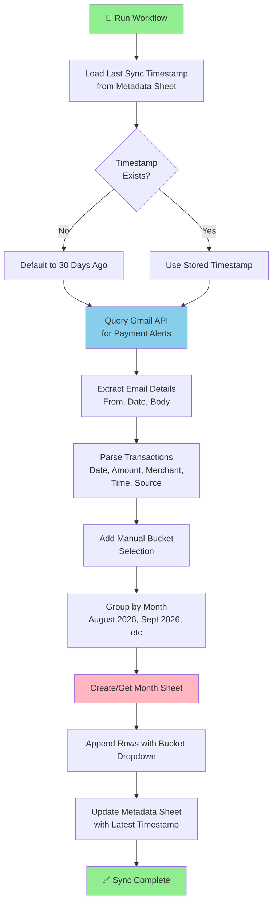

# Finance Tracker Agent 🏦

An AI-powered finance automation tool that automatically extracts payment notifications from Gmail, parses transaction details, and stores them in Google Sheets for cloud-based record keeping.

## 📋 Table of Contents
- [Features](#features)
- [Architecture](#architecture)
- [Prerequisites](#prerequisites)
- [Setup Instructions](#setup-instructions)
- [Configuration](#configuration)
- [Usage](#usage)
- [Project Structure](#project-structure)
- [Workflow](#workflow)

---

## ✨ Features

✅ **Automated Email Extraction** - Fetches payment alerts from Axis Bank & ICICI Bank  
✅ **Intelligent Parsing** - Extracts date, amount, merchant, and time from emails  
✅ **Monthly Organization** - Automatically creates separate sheets for each month  
✅ **Duplicate Prevention** - Timestamp-based tracking to avoid duplicate entries  
✅ **Source Tracking** - Identifies bank type and credit card transactions  
✅ **Manual Expense Bucketing** - Adds a dropdown for selecting a bucket per transaction
✅ **Cloud Storage** - All data synced to Google Sheets in real-time  
✅ **Timezone Awareness** - Proper handling of timestamps and timezones  

---

## 🏗️ Architecture

```
┌─────────────────────────────────────────────────────────────┐
│                  Finance Tracker Agent                      │
└─────────────────────────────────────────────────────────────┘
                              │
        ┌─────────────────────┼─────────────────────┐
        │                     │                     │
    ┌───▼──────────┐      ┌──▼────────┐       ┌───▼──────────┐
    │ Gmail Agent  │      │  Parser   │       │ Sheets Agent │
    │ (OAuth2)     │      │ (Regex)   │       │ (gspread)    │
    └──────────────┘      └───────────┘       └──────────────┘
        │                     │                     │
        ▼                     ▼                     ▼
    Gmail API            Text Processing      Google Sheets API
    - Fetch emails       - Extract date       - Create sheets
    - Filter by sender   - Extract amount     - Append rows
    - Track timestamp    - Extract merchant   - Update metadata
                         - Extract time
```

---

## 📋 Prerequisites

### 1. **Python 3.9 or Higher**
```bash
python --version
```

### 2. **Google Account** (Gmail + Google Sheets)
- Gmail inbox with payment notifications
- Google Drive access for creating sheets

```bash
pip install -r requirements.txt
```

**Key dependencies:**
- `google-auth-oauthlib` - OAuth2 authentication
- `google-auth` - Google authentication
- `google-api-python-client` - Gmail API client
- `gspread` - Google Sheets library
- `python-dateutil` - Date parsing

---
4. ✅ Adds each transaction with a manual bucket dropdown
5. ✅ Appends transactions with Date, Time, Amount, Merchant, Source, Bucket
## 🔧 Setup Instructions


1. Go to [Google Cloud Console](https://console.cloud.google.com/)
2. Click **"Select a Project"** → **"New Project"**
3. Enter project name: `Finance Tracker Agent`
4. Click **"Create"**
5. Wait for the project to be created

### Step 2: Enable Required APIs

#### Enable Gmail API:
1. Go to [APIs & Services](https://console.cloud.google.com/apis/dashboard)
2. Click **"+ ENABLE APIS AND SERVICES"**
3. Search for **"Gmail API"**
4. Click it and press **"ENABLE"**

#### Enable Google Sheets API:
1. Go to [APIs & Services](https://console.cloud.google.com/apis/dashboard)
2. Click **"+ ENABLE APIS AND SERVICES"**
3. Search for **"Google Sheets API"**
4. Click it and press **"ENABLE"**

#### Enable Google Drive API:
1. Go to [APIs & Services](https://console.cloud.google.com/apis/dashboard)
3. Search for **"Google Drive API"**
4. Click it and press **"ENABLE"**

### Step 3: Create OAuth2 Credentials

1. Go to [Google Cloud Console - Credentials](https://console.cloud.google.com/apis/credentials)
2. Click **"+ CREATE CREDENTIALS"** → **"OAuth client ID"**
3. If prompted to create a consent screen:
   - Select **"External"** for User Type
   - Fill in the application name: `Finance Tracker Agent`
   - Add your email as the test user
   - Complete the consent screen setup
4. After returning to Credentials:
   - Click **"+ CREATE CREDENTIALS"** → **"OAuth client ID"**
   - Choose **"Desktop app"**
   - Click **"Create"**
5. Click the **download icon** (⬇️) to download JSON
6. Save the file as **`config/credentials.json`**

### Step 4: Create a Google Sheet

1. Go to [Google Sheets](https://sheets.google.com/)
2. Click **"+ New"** → **"Blank spreadsheet"**
4. Copy the Sheet ID from the URL:
   ```
   https://docs.google.com/spreadsheets/d/YOUR_SHEET_ID_HERE/edit
   ```

### Step 5: Configure the Project

1. Clone/download this repository
2. Create the required directories:
   ```bash
   mkdir -p config data
   ```

3. Place `credentials.json` in the `config/` folder

4. Update `src/workflow.py` with your Sheet ID:
   ```python
   sheet_id = "YOUR_SHEET_ID_HERE"  # Replace with your actual ID
   ```

5. Install dependencies:
   ```bash
   pip install -r requirements.txt
   ```

---

## 🚀 Usage

### First Run (Authentication)
```bash
cd src
python workflow.py
```

**On first run:**
- A browser window will open asking for Gmail authorization
- Accept the permissions (reads Gmail only, no write access)
- A browser window will open for Sheets authorization
- Accept the permissions

### Subsequent Runs
```bash
python workflow.py
```
**What happens:**
1. ✅ Fetches payment emails from the last sync timestamp
2. ✅ Parses transaction details
3. ✅ Creates/updates monthly sheets
4. ✅ Adds each transaction with `Please select bucket` in the Bucket dropdown
5. ✅ Appends transactions with Date, Time, Amount, Merchant, Source, Bucket

### Output Example
```
Starting Finance Tracker Agent...
Last sync timestamp: 1693324800
Fetched 15 emails

Appending 12 transactions to 'August 2026' sheet...
  Using existing sheet: 'August 2026'
  ✓ Appended 12 transactions to 'August 2026'

Appending 3 transactions to 'September 2026' sheet...
  Created new sheet: 'September 2026'
  ✓ Appended 3 transactions to 'September 2026'

Updated sync timestamp to: 1693584542
✓ Workflow completed successfully!
```

---

## ⚙️ Configuration

### Tracked Bank Senders
The agent tracks payment alerts from:
- **Axis Bank**: `alerts@axis.bank.in`
- **ICICI Bank**: `alert@icici.bank.in`

To add more banks, edit [src/gmail_agent.py](src/gmail_agent.py):
```python
query = f"(from:alerts@axis.bank.in OR from:alert@icici.bank.in OR from:your_bank@example.com) after:{unix_date}"
```

### Query Date Range
Default: Last 30 days. Modify in [src/workflow.py](src/workflow.py):
```python
one_month_ago = datetime.now(tz=timezone.utc) - timedelta(days=30)
# Change 30 to your preferred number of days
```

### Expense Buckets
Bucket options are maintained in [src/buckets.py](src/buckets.py). Add a name to
`BUCKET_OPTIONS` to make it available in the Google Sheets dropdown. New rows
start with `Please select bucket`; choose `Rent`, `Petrol`, `DailyExpenses`, or
`Beta` manually for each transaction.

Run the business logic tests with:
```bash
python -m unittest discover -s tests -v
```

---

## 📁 Project Structure

```
finance-tracker-agent/
├── src/
│   ├── __init__.py
│   ├── gmail_agent.py       # Gmail API operations
│   ├── buckets.py           # User-editable bucket rules
│   ├── bucket_agent.py      # Optional legacy merchant classification helper
│   ├── sheets_agent.py      # Google Sheets operations
│   ├── parser.py            # Transaction parsing logic
│   ├── utils.py             # Utility functions
│   └── workflow.py          # Main orchestration (ENTRY POINT)
├── tests/
│   └── test_bucket_agent.py # Bucket business logic tests
├── config/
│   ├── credentials.json     # OAuth credentials (⚠️ DO NOT COMMIT)
│   └── sheets.json          # (Optional) Sheets config
├── data/
│   ├── token.json           # Gmail auth token (⚠️ DO NOT COMMIT)
│   └── sheets_token.json    # Sheets auth token (⚠️ DO NOT COMMIT)
├── requirements.txt         # Python dependencies
├── pyproject.toml           # Project metadata
└── README.md                # This file
```

---

## 🔄 Workflow



**Workflow Steps:**

1. **Initialize** - Load the last sync timestamp from the metadata sheet
2. **Default Check** - If no timestamp, use 30 days ago
3. **Query Gmail** - Fetch payment alert emails after the timestamp
4. **Extract Headers** - Get sender, date, and email body
5. **Parse** - Extract structured data (date, amount, merchant, time, source)
6. **Select Bucket** - Choose a bucket manually in the Bucket dropdown
7. **Group** - Organize transactions by month
8. **Create Sheets** - Dynamically create sheets per month if needed
9. **Append Data** - Batch insert all transactions to respective sheets
10. **Update Metadata** - Store the latest timestamp to prevent duplicates
11. **Complete** - Next run will only fetch new emails

---

## 🔐 Security Notes

⚠️ **Never commit these files to version control:**
```
config/credentials.json
data/token.json
data/sheets_token.json
```

Add to `.gitignore`:
```
config/credentials.json
data/
.env
```

---

## 🐛 Troubleshooting

### Issue: "SpreadsheetNotFound"
**Solution:** Update the `sheet_id` in [src/workflow.py](src/workflow.py) with your actual Google Sheet ID

### Issue: "APIError: [401] Invalid Credentials"
**Solution:** Delete `data/token.json` and `data/sheets_token.json`, then run the workflow again to re-authenticate

### Issue: "No metadata sheet found"
**Solution:** This is normal on first run. The metadata sheet will be created automatically after the first sync

### Issue: "Quota exceeded" errors
**Solution:** The code uses batch operations to prevent rate limiting. Wait a few minutes before running again

---

## 📞 Support & Contribution

For issues or feature requests, feel free to open an issue or reach out.

---

## 📄 License

This project is open source and available under the MIT License.

---

**Last Updated:** August 31, 2026
